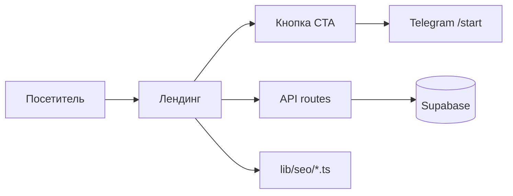

# Landing Photo2Sticker — Обзор архитектуры

## Назначение

SEO-сайт для бота [@Photo_2_StickerBot](https://t.me/Photo_2_StickerBot): конверсия посетителей в переход в Telegram с сохранением источника (UTM, yclid) для Директа и офлайн-конверсий в Метрику.

## Стек

| Компонент | Технология |
|-----------|------------|
| Фреймворк | Next.js 15 (App Router) |
| Язык | TypeScript (Node 20+) |
| Стили | Tailwind CSS |
| Данные | Конфиг в коде + Supabase (PostgreSQL, Storage) |
| Деплой | В составе монорепо (Docker Host и др.) |

## Структура каталогов

```
landing/
├── app/                      # Next.js App Router
│   ├── page.tsx              # Главная (/)
│   ├── layout.tsx            # Общий layout, мета, скрипты Метрики
│   ├── style/                # Каталог стилей и вложенные страницы
│   │   ├── page.tsx          # /style
│   │   ├── [group]/page.tsx  # /style/anime, /style/memy, ...
│   │   └── [group]/[substyle]/page.tsx  # /style/anime/chibi, ...
│   ├── bot/, telegram/, besplatno/, ...  # Кластерные страницы
│   └── api/                  # API routes
│       ├── styles/groups/    # Карточки стилей для главной/кластеров
│       ├── landing/hero-preset/  # Hero-пресет по пути страницы
│       └── packs/content-sets/  # Контент-паки для EmotionPackCarousel
├── components/landing/      # UI: Hero, FAQ, Pain/Hope, галереи, CTA
├── lib/
│   ├── seo/                  # Конфиг контента (не из БД)
│   │   ├── cluster-pages.ts  # Кластеры: /bot, /telegram, ... + главная (main)
│   │   └── style-groups.ts   # Группы и подстили для /style/[group]
│   ├── supabase.ts           # Клиент Supabase
│   ├── utils.ts              # buildTelegramStartLink(utm + yclid)
│   ├── landing-hero-preset.ts   # Резолв hero по пути (landing_hero_paths)
│   ├── landing-style-catalog-db.ts  # Каталог /style из БД
│   └── bot-link.tsx          # Текст @Photo_2_StickerBot как ссылка
└── docs/                     # Документация (эта папка)
```

## Потоки данных



- **Контент страницы:** кластеры и стилевые группы — из `lib/seo/cluster-pages.ts`, `style-groups.ts`.
- **Динамика:** список стилей для блока «Выбери стиль», hero-пак по пути страницы, контент-паки для пилюль — из Supabase через API.

## Hero и превью стилей

- **Hero (главная и кластеры):** для путей из `style_presets_v2.landing_hero_paths` показывается пак стиля `pack/style/{preset_id}/1..9.webp`. Для кластерных путей (/, /style, /bot, …) используется пресет `photo_realistic`.
- **Превью карточек стилей:** первый стикер пака стиля — `pack/style/{preset_id}/1.webp` (без приоритета `stickers.is_example`). Источник: API `GET /api/styles/groups` и `landing-style-catalog-db.ts`.

## CTA и метрика

- Кнопка «Открыть в Telegram» ведёт на `t.me/Photo_2_StickerBot?start=...`.
- **Без UTM/yclid:** `start=web` (главная) или `start=web_{pageSlug}` (например `web_bot`).
- **С UTM или yclid в URL:** payload собирается из `utm_source`, `utm_medium`, `utm_campaign`, `utm_content`, `yclid` (до 64 символов). Бот парсит payload, сохраняет в `users`, при оплате отправляет офлайн-конверсию в Метрику.

Подробнее: [../utm-tracking.md](../utm-tracking.md), в корне репо — [../../docs/13-02-yandex-direct-conversions.md](../../docs/13-02-yandex-direct-conversions.md).

## Связанные документы

- [01-pages-and-routes.md](./01-pages-and-routes.md) — страницы и маршруты
- [02-api-and-data.md](./02-api-and-data.md) — API и данные Supabase
